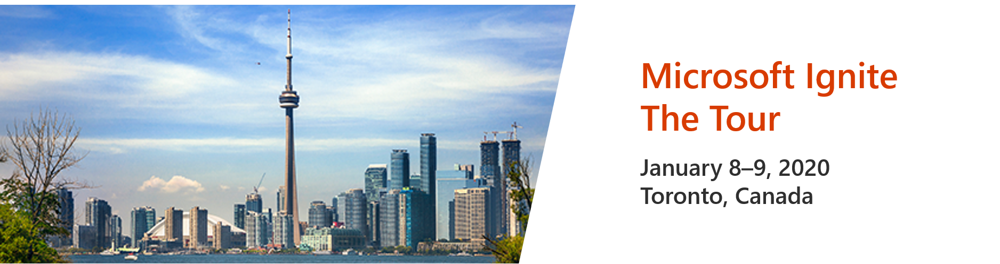

# Microsoft Ignite The Tour | Toronto Demos

A copy of our presentation is here along with some of the top Q&A topics.

## Additional Links

- Windows 10 IoT Core open source BSP for RPi2, RPi3, Pi3 Compute Module, and RP3B+: https://github.com/ms-iot/rpi-iotcore
- Service Windows 10 IoT Core: https://docs.microsoft.com/en-us/windows-hardware/service/iot/